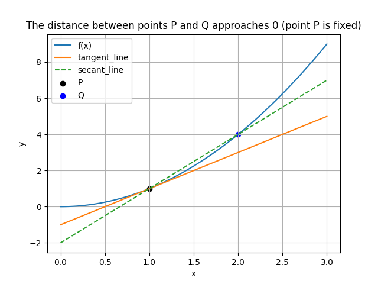
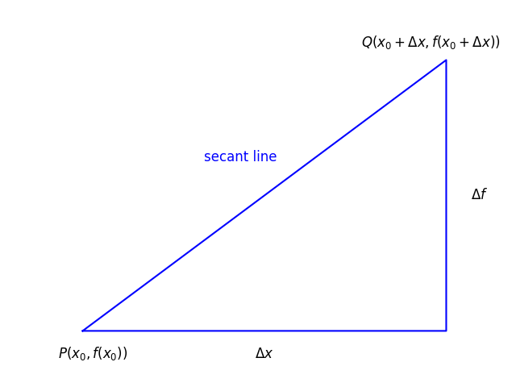
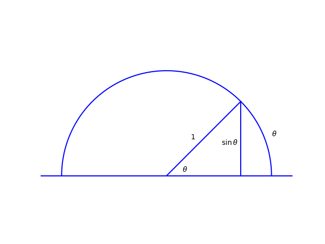
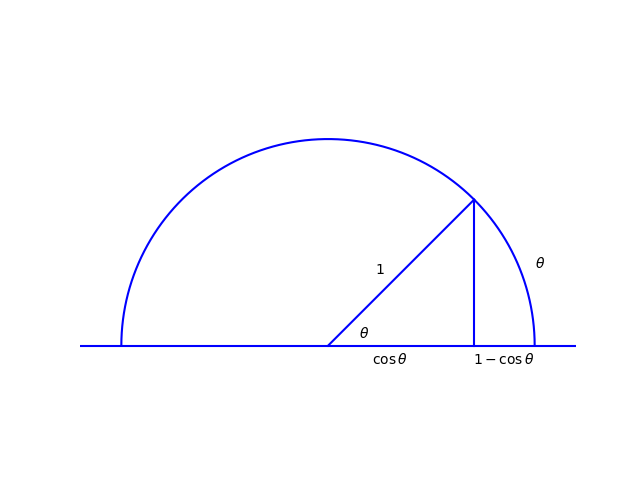

# Unit 1 Derivatives
****
## Lecture 1: What is a derivative?

**1. The derivative is the limit of the secant line approaching the tangent line:**
- Geometric interpretation:

- Algebraic Explanation:

$$
\lim _{\Delta x \rightarrow 0} \frac{\Delta f}{\Delta x}=\lim _{\Delta x \rightarrow 0} \frac{f\left(x_0+\Delta x\right)-f\left(x_0\right)}{\Delta x}=f^{\prime}\left(x_0\right)
$$

**2. Example:**

$$ 1、f(x)=\frac{1}{x} $$ 

$$
\begin{aligned}
proof:\frac{\Delta f}{\Delta x} & =\frac{\frac{1}{(x+\Delta x)}-\frac{1}{x}}{\Delta x} \\
& =\frac{-\Delta x}{\Delta x \cdot x \cdot(x+\Delta x)} \\
& =\frac{-1}{x \cdot(x+\Delta x)} \\
f^{\prime}(x) & =\lim _{\Delta x \rightarrow 0} \frac{\Delta t}{\Delta x} \\
& =\lim _{\Delta x \rightarrow 0} \frac{-1}{x \cdot(x+\Delta x)} \\
& =-\frac{1}{x^2}
\end{aligned}
$$

$$ 2、f(x)=x^n $$ 

$$
\begin{aligned}
proof:\frac{\Delta f}{\Delta x} & =\frac{(x+\Delta x)^n-x^n}{\Delta x} \\
& =\frac{x^n+n \cdot \Delta x \cdot x^{n-1}+o\left[(\Delta x)^2\right]-x^n}{\Delta x} \\
& =n \cdot x^{n-1}+o(\Delta x) \\
f^{\prime}(x) & =\lim _{\Delta x \rightarrow 0} \frac{\Delta f}{\Delta x} \\
& =\lim _{\Delta x \rightarrow 0}\left[n \cdot x^{n-1}+o(\Delta x)\right] \\
& =n \cdot x^{n-1}
\end{aligned}
$$

**3. Note:**

Tangent Line Equation: 
$$y-y_0=f^{\prime}\left(x_0\right)\left(x-x_0\right)$$
****

## Lecture 2: Limits and Continuity

**1. Limits:**
$$
\lim _{x \rightarrow x_0} \frac{\Delta f}{\Delta x}=\lim _{x \rightarrow x_0} \frac{f\left(x_0+\Delta x\right)-f\left(x_0\right)}{\Delta x}
$$

**2. Continuity:**
$$
\lim _{x \rightarrow x_0} f(x)=f\left(x_0\right)
$$

Removable discontinuities of the first type:
$$\lim_{x\rightarrow x_{0}^{+}}f(x)=\lim_{x\rightarrow x_{0}^{-}}f(x)\neq f(x_{0})$$

Jump discontinuities of the first type:
$$\lim_{x\to x_{0}^{+}}f(x)=a\neq b=\lim_{x\to x_{0}^{-}}f(x)$$

Infinite discontinuities of the second type:
$$\lim_{x\to x_{0}^{+}}f(x)/\lim_{x\to x_{0}^{-}}f(x)\to\infty$$

Other discontinuities of the second type.

**3. Two trigonometric limits:**
$$
\lim _{\theta \rightarrow 0} \frac{\sin \theta}{\theta}=1 
$$

$$\lim_{\theta\to0}\frac{1-\cos\theta}{\theta}=0$$

**4. Theorem:**
A differentiable function must be continuous:
$$
\begin{aligned}
proof: & \lim_{x\to x_{0}}(f(x)-f(x_{0})) \\
 & =\lim_{x\to x_{0}}\frac{f(x)-f(x_{0})}{x-x_{0}}\cdot(x-x_{0}) \\
 & =f(x_{0})\cdot0=0
\end{aligned}
$$
****